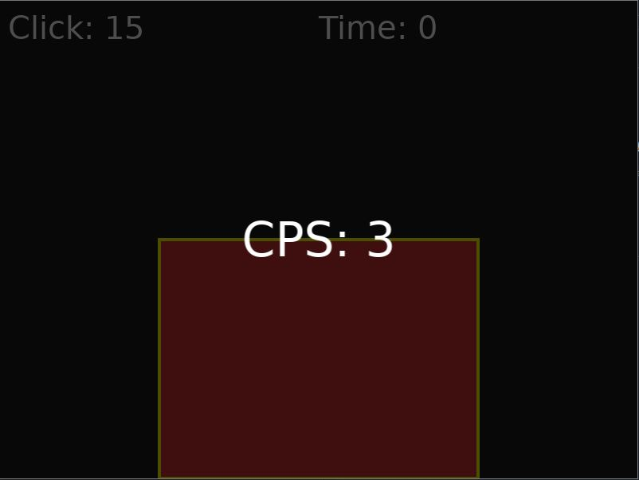

# CPS Tester

This is a simple Clicks Per Second (CPS) tester game implemented using LÖVE (Love2D), a framework for creating 2D games in Lua. The objective of the game is to click on a target as many times as possible within a set time limit to measure your CPS.

## Requirements

- [LÖVE (Love2D)](https://love2d.org/) version 11.3 or later.

## Game Overview

The game consists of a target that appears on the screen. The player needs to click on the target to increase their score. The game runs for a fixed duration of 5 seconds, after which the CPS (Clicks Per Second) is calculated and displayed.

## Features

- A rectangular target that the player must click.
- A countdown timer that shows the remaining time.
- A score counter that increments with each successful click on the target.
- A CPS display after the game ends.

## How to Run

1. Install [LÖVE (Love2D)](https://love2d.org/).
2. Save the following code into a file named `main.lua`.
3. Drag and drop the `main.lua` file onto the LÖVE executable or run it using the command line.

